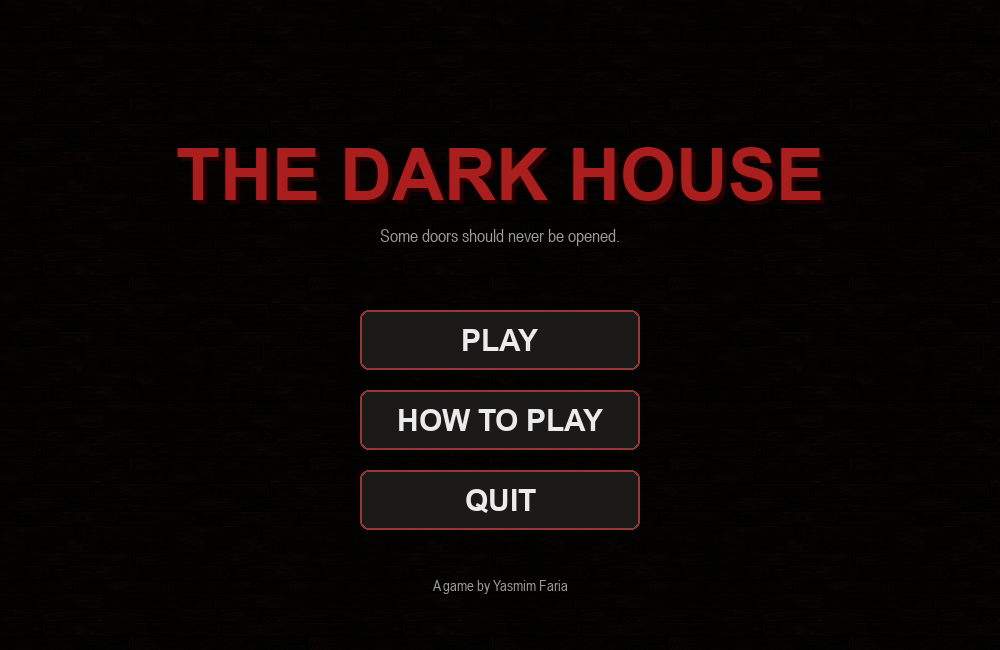
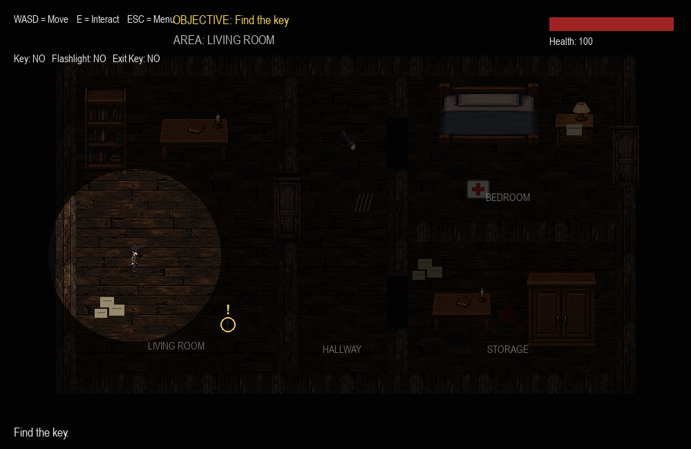
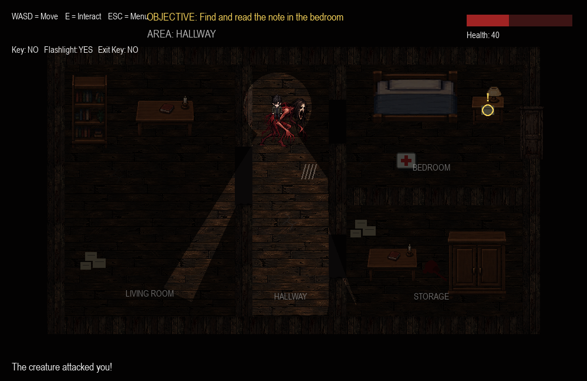
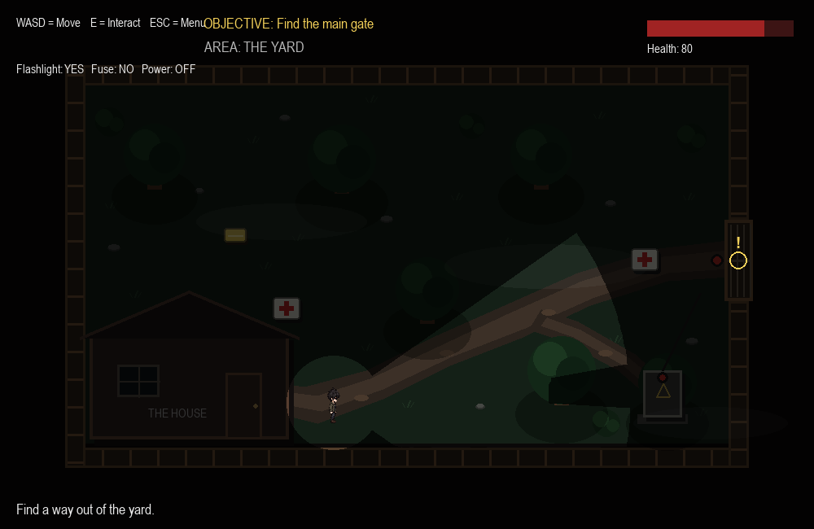
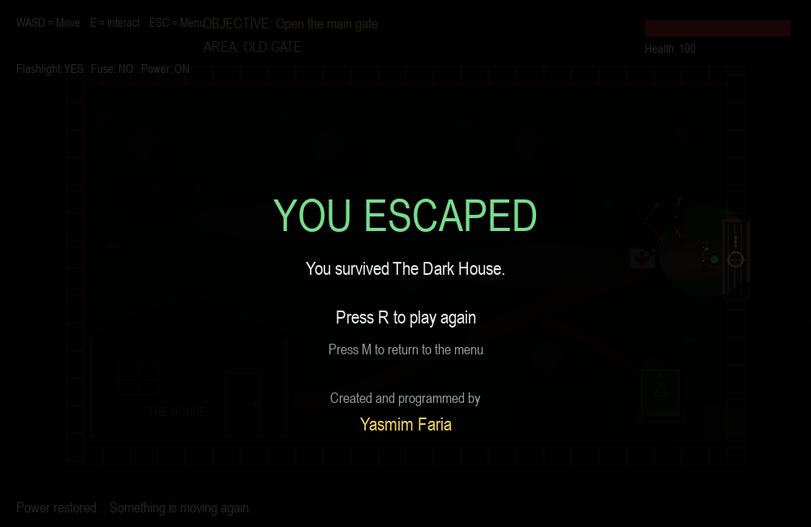

# The Dark House

**The Dark House** is a 2D top-down horror game created with Python and Pygame.

The player explores an abandoned house, searches for keys and clues, manages limited health, avoids a pursuing creature, and escapes into a second chapter set in a dark outdoor yard.

**Created and programmed by Yasmim Faria.**

## Features

- Two playable chapters: **The House** and **The Yard**
- Directional flashlight with wall and object blocking
- Random flashlight flickering
- Enemy AI with patrol, chase, search, line-of-sight detection, and pathfinding
- Collision system for walls, furniture, trees, doors, and environmental objects
- Health system with medkits
- Health carries from Chapter 1 into Chapter 2
- Interactive notes, keys, locked doors, fuse box, and exit gate
- Dynamic objectives and objective markers
- Player animation in four directions
- Ambient audio and sound effects
- Main menu, How to Play screen, chapter transition, game-over screen, and final credits

## Controls

| Key | Action |
| --- | --- |
| `W A S D` | Move |
| `E` | Interact |
| `ESC` | Close a note / return to menu |
| `ENTER` | Start game / continue to next chapter |
| `R` | Restart after game over |
| `M` | Return to menu from an ending screen |

## Story

You wake inside a dark abandoned house with no clear way out.

To escape, you must explore the rooms, collect useful items, read clues, and avoid the creature moving through the building.

Escaping the house is only the beginning.

In **Chapter 2: The Yard**, the main gate has no power. You must find a missing fuse, restore electricity, and reach the gate before the creature finds you again.

## Requirements

- Python 3
- Pygame 2.6.1

Install the dependency with:

```bash
pip install -r requirements.txt
```

## Running the Game

From the project folder, run:

```bash
python game_2d.py
```

The `assets` folder must remain in the same project directory as `game_2d.py`.

## Project Structure

```text
The-Dark-House/
├── game_2d.py
├── README.md
├── requirements.txt
├── CREDITS.md
├── .gitignore
├── assets/
│   ├── player sprites
│   ├── furniture sprites
│   ├── monster.png
│   ├── key.png
│   ├── flashlight.png
│   ├── door.png
│   ├── floor.png
│   ├── wall.png
│   └── sound files
└── screenshots/
    ├── 01-menu.png
    ├── 02-house.png
    ├── 03-flashlight-chase.png
    ├── 04-chapter-2-yard.png
    └── 05-ending.png
```

## Screenshots

Add your final screenshots to the `screenshots` folder and replace these placeholders:

### Main Menu



### Chapter 1 — The House



### Flashlight and Enemy Encounter



### Chapter 2 — The Yard



### Ending



## Technical Highlights

Some of the systems developed for this project include:

- Grid-based enemy pathfinding
- Line-of-sight checks for enemy detection
- Multiple enemy states: patrol, chase, and search
- Directional ray-based flashlight lighting
- Collision detection with separate visual and collision boundaries
- Scene and chapter state management
- Persistent health between chapters
- Interactive inventory and objective progression

## What I Learned

This project was developed while learning Python and Pygame.

Building the game required solving problems involving collision detection, animation, enemy behavior, lighting, pathfinding, game states, level progression, UI design, and debugging.

The project grew from a small game experiment into a complete two-chapter playable experience.

## Creator

**Yasmim Faria**  
Game design and programming

See [`CREDITS.md`](CREDITS.md) for additional credits and asset information.

## Portfolio Note

This project is part of my computer science portfolio and represents my learning process in programming, game development, problem solving, and software design.
